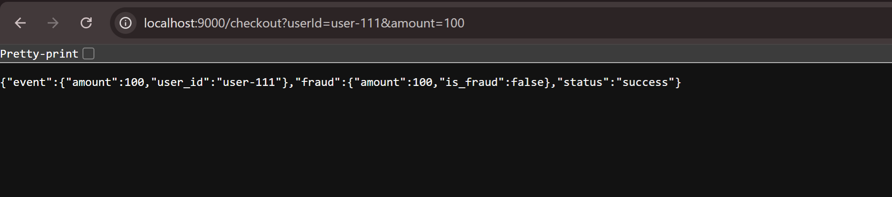

# Checkout Service

This backend service provides a checkout functionality. It receives user and transaction details, publishes an event to a message queue, and simultaneously checks for fraud by calling an inference service.

## Functionality

When a request is made to the `/checkout` endpoint, the service performs two main actions:

1.  **Event Publishing**: It publishes a `checkout.event` message to a RabbitMQ queue. The message contains the `user_id` and `amount` of the transaction.
2.  **Fraud Detection**: It makes a synchronous call to a fraud inference service to get a real-time fraud assessment for the transaction.

The service then returns a JSON response containing the status of the operation, the event data sent, and the result from the fraud detection service.

## API

### `GET /checkout`

Handles a checkout request.

#### Query Parameters

-   `userId` (string, required): The ID of the user making the transaction.
-   `amount` (float, required): The transaction amount.

#### Example Request

```
GET /checkout?userId=user-111&amount=100
```

#### Example Response



## Configuration

The service is configured via the following environment variables:

-   `RABBITMQ_HOST`: The hostname of the RabbitMQ server. (Default: `rabbitmq.messaging.svc.cluster.local`)
-   `RABBITMQ_USER`: Username for RabbitMQ. (Default: `user`)
-   `RABBITMQ_PASSWORD`: Password for RabbitMQ. (Default: `guest`). This is already provisioned by Terraform as K8s secret in the namespace where this service will be deployed.
-   `FRAUD_INFERENCE_URL`: The URL of the fraud inference service. (Default: `http://inference-service.services.svc.cluster.local/predict`)